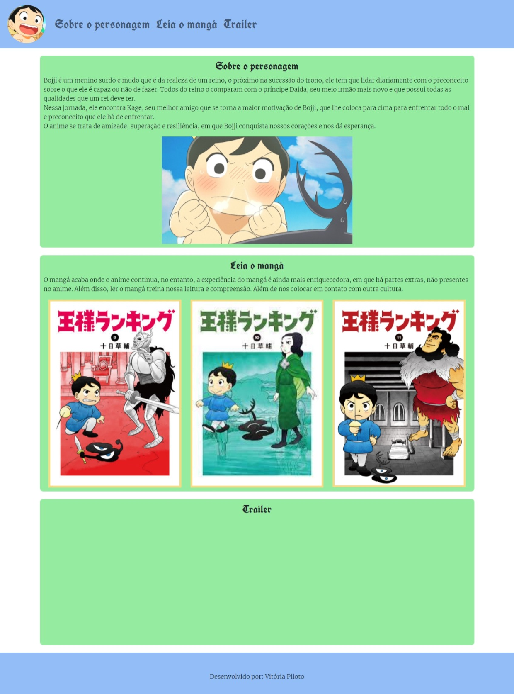

# Aula Bootstrap

### Utilizando o framework bootstrap - divs, containers, nav e etc

**Além do bootstrap:**
- Javascript para aumentar a imagem ao passar o mouse;
- Uso do google fonts;
- Uso do iframe para vídeo do youtube.
